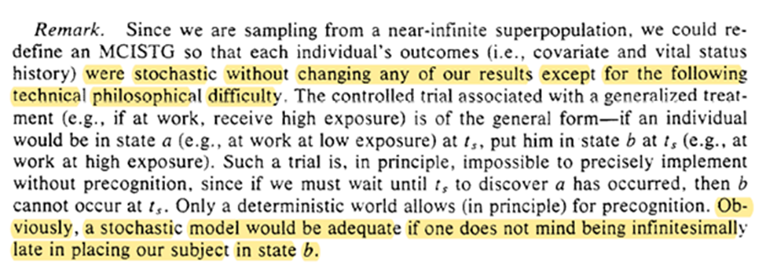
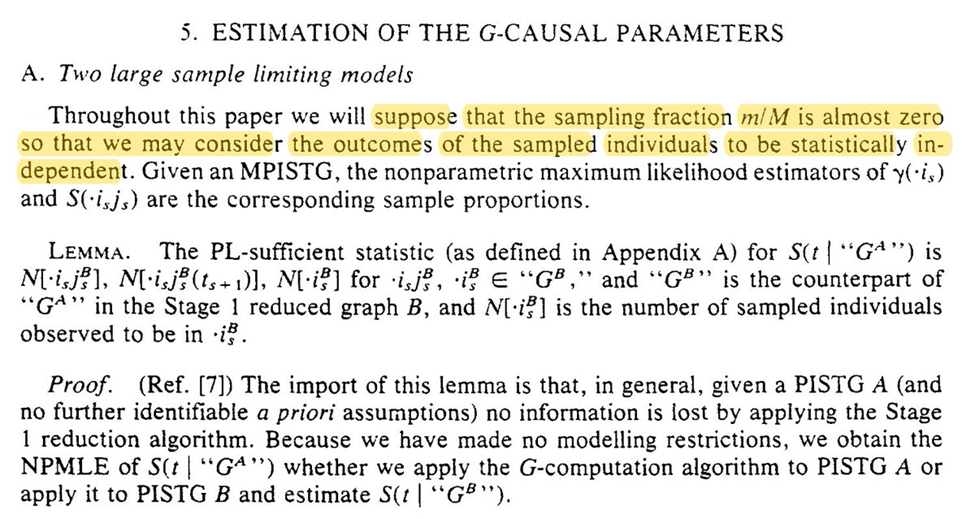
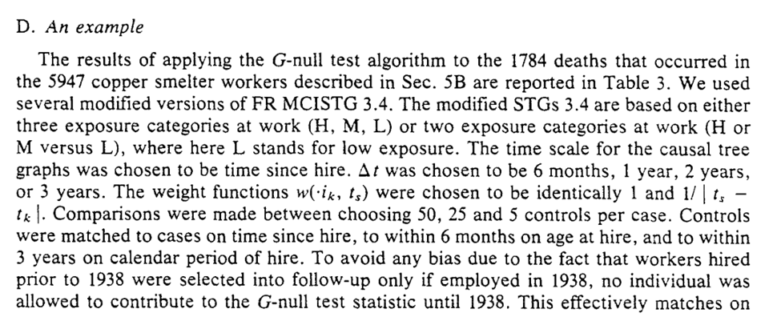

During 2020, I read through Robins, J. (1986). "A new approach to causal inference in mortality studies with a 
sustained exposure period—application to control of the healthy worker survivor effect". *Mathematical modelling*, 
7(9-12), 1393-1512. This was all shared on Twitter. As I deleted my Twitter account long ago now, this thread 
disappeared along with it. To preserve it, I now host it here. 

Below is all from the original 2020 thread. There is likely different elements I would emphasize now, but I leave that
for a future date.

## Setup

Because I have been meaning to read through it fully and this is a better way to keep myself accountable, a thread 
as I (we) read through Robins 1986. (Also writing it out helps me think better)

I will probably do a section every (or every few) day(s)
Some of my nomenclature: 
* CI – Causal inference
* RR – Risk Ratio
* HWE – Healthy worker effect
* DAG - Directed Acyclic Graph
* LTFU - lost-to-follow-up
* RCT - randomized control trial (overlook the 'control' in some of the discussion, I use for ease of abbrev.)

(going to regret not putting more here)


## 1: INTRODUCTION
After 3 pages of vocab and the section it is defined in, we start with the introduction. 

Robins begins with the difficulty of defining an appropriate comparison for a working population, 
since an unexposed* working pop is ‘healthier’ than the general pop


I think most importantly is that Robins sets out to identify ‘small’ effects since most large occupational exposures 
already have been discovered. I think this stands in stark contrast to claims about CI being less appropriate for small 
effects or sensitivity analyses (E-values).

To avoid the HWE, workers with different levels of exposure are compared. However, the standard methods of looking at 
cumulative exposures can mask those small effects Robins is interested in.


To relate to the larger literature, he mentions this paper by Gilbert. This approach is later said to be commonly used 
in occupational epi (at the time).

Gilbert 1982 talks about occupational factors at the Hanford nuclear site on mortality. Gilbert says that differences 
in mortality between employed and terminated works are sources of bias due to the healthy worker effect.


To address this, workers were considered as ‘employed’ up to 3 years after their termination. Gilbert’s approach works 
as a sort of ‘wash-out’ period for occupational exposures. However, Robins says this wash-out approach doesn’t work and 
we will see this in occupational exposure to arsenic. He gives us a teaser (so we get through the following 100+ pages).


Occupational arsenic has been decreased post-1935 but lung cancer has remained elevated among copper smelter workers. 
This could be due to (1) remaining arsenic exposures, or (2) elevated cigarette smoking among workers. Using the 
lagging approach, cumulative exposure to arsenic has no association with lung cancer mortality. However, Robins’ 
proposed approach does find elevated lung cancer mortality. He conjectures that it is due to smokers leaving employment 
more than non-smokers. He can’t directly tell us (so a bit of a letdown).


Robins then says that using the proposed method is necessary because of reduced occupational exposures leading to 
smaller effects (as indicated by RR).


Then he hit us with the succinct purpose of the paper; when do we get to give causal interpretations for time-varying 
exposures with observational data. Robins then outlines what each section will discuss. I won’t repeat / spoil it 
though (but it would be great to do a SPOILER ALERT for a paper that is older than me).

## 2: OBS STUDY AS RCT

This section is probably one of the most important insights, framing observational data as a randomized trial conducted 
by nature (I think I might like causal inference as a missing data problem more though).


We start with an example. To add, I am going to adapt a quick example to illustrate his previous point regarding 
‘small effects’ from Section 1 to highlight the importance of his previous argument. Pictured is a DAG for a data 
generating mechanism and some Python code.


```python
import numpy as np
import pandas as pd
import matplotlib.pyplot as plt
from zepid.causal.causalgraph import DirectedAcyclicGraph

# Drawing a DAG
dag = DirectedAcyclicGraph(exposure=r"$$A_1$$", outcome=r"$Y$")
dag.add_arrows(((r"$A_1$", r"$Y$"),
                (r"$A_2$", r"$Y$"),
                (r"$A_1$", r"$A_2$"),
                (r"$A_1$", r"$U$"),
                (r"$U$", r"$A_2$")))
dag.draw_dag(fig_size=(6, 4),
             positions={r"$A_1": (1, 1),
                        r"$A_2": (3, 1),
                        r"$U": (2, 1.05),
                        r"$Y": (4, 1)})
plt.show()

# Generating data
np.random.seed(1986)
n = 1000000

# Defining potential outcomes
df = pd.DataFrame()
df['y_a0a0'] = np.random.binomial(n=1, p=0.4, size=n)
df['y_a1a0'] = np.random.binomial(n=1, p=0.45, size=n)
df['y_a0a1'] = np.random.binomial(n=1, p=0.55, size=n)
df['y_a1a1'] = np.random.binomial(n=1, p=0.6, size=n)

# Alloting treatments
df['A_1'] = np.random.binomial(n=1, p=0.5, size=n)
df['U'] = np.random.binomial(n=1, p=0.2 + 0.4*df['A_1'], size=n)
df['A_2'] = np.random.binomial(n=1, p=df['A_1']*0.85 +
                                      (1-df['A_1'])*0.15 -
                                       0.1*df['U'], size=n)

# Applying causal consistency
df['Y'] = (df['A_1']*df['A_2']*df['y_a1a1'] + 
           (1-df['A_1'])*df['A_2']*df['y_a0a1'] + 
           df['A_1']*(1-df['A_2'])*df['y_a1a0'] + 
           (1-df['A_1'])*(1-df['A_2'])*df['y_a0a0']) 
```

Since $A$ is randomized at baseline ($t_1$), we can easily estimate $\Pr(Y(a_1))$ with $\Pr(Y \mid A_1=a_1)$ where 
$Y(a_1)$ is the potential outcome under $a_1$. In my example $\hat{\Pr}(Y \mid A_1=1) / \hat{\Pr}(Y \mid A_1=0)$ is

```python
# Calculating Risk Ratio
from zepid import RiskRatio

rr_est = RiskRatio()
rr_est.fit(df, exposure='A_1', outcome='Y')
rr_est.summary()

# RiskRatio  SD(RR)  RR_LCL  RR_UCL
#     1.354   0.002   1.349    1.36
```

However, I am using 1mil observations for that estimate. That’s probably more than we have in most scenarios. Under the 
more realistic case of 750 observations, things are less clear.

```python
rr_est = RiskRatio()
rr_est.fit(df.sample(n=750), exposure='A_1', outcome='Y')
rr_est.summary()

# RiskRatio  SD(RR)  RR_LCL  RR_UCL
#     1.172   0.074   1.014   1.355
```

Since we are using some simulated data, we can check another estimand $\Pr(Y(a_1, a_2))$. For cumulative effects (i.e., 
effect is monotonic over time), $\Pr(Y(a_1, a_2)) \ge \Pr(Y(a_1))$. This means we have a better chance of identifying 
‘small effects’ of $A$ by targeting $\Pr(Y(a_1, a_2))$.

```python
# Calculating Pr(Y(a_1, a_2)_ directly
print(np.mean(df['y_a1a1']) / np.mean(df['y_a0a0']))
# RiskRatio
#     1.502
```

However, using $\Pr(Y \mid A_1=a_1, A_2=a_2))$ doesn’t correctly estimate the previous quantity because of the $U$ I 
drew in the previous DAG. That’s why we need this paper and the proposed method.

Already we are given a glimpse of what Robins is talking about when he talks about using time-varying exposures to 
identify effects. Returning to Robins example, he gives us this nice tree ($G_m$ is moderate exposure)


He gives us a table based on some categorizations of the exposures (I have an updated table below). As seen, high 
exposure seems protective. However, we know this isn’t true (the exposure has no effect).

|  | High | Moderate | Low |
| --- | :---: | :---: | :---: |
| Events | 60 | 160 | 100 |
| Total | 200 | 400 | 200 |
| Risk | 0.3 | 0.4 | 0.5 |
| Risk Ratio | 0.6 | 0.8 | 1 |

Rather it is a result of the exposure being an irritant and resulting in unhealthy individuals quitting work earlier 
than healthy individuals.

Robins mentions in this section, if we had treated the baseline assignment of exposure categories (high vs medium) at 
$t_1$, we would correctly have estimated no effect: $RR = (160/400) / (160/400) = 1.0$


We see how to foundation of observational studies as a randomized trial. Our collaborator, Dr. Nature, isn’t always the 
most organized and seemingly forgets to forward the randomization protocol to us. A primary challenge is determining 
when we consider an individual to deviate from their assigned protocol.


Robins states if we (accurately) measure day of death, exposure history, date of leaving the exposure protocol, then we 
can estimate mortality. The trick for translating obs. data into this is to determine when individuals leave the 
protocol.

A related issue (one-sample rather than the two-sample problem Robins is addressing) is when to consider someone as 
censored (LTFU). [Lesko et al.](https://pubmed.ncbi.nlm.nih.gov/29020256/) have a nice discussion of when we should 
consider someone as censored.

For Robins’ example date of termination of employment works well as the time of deviation from protocol. He also tells 
us a similar exposure protocol end date for the mining industry.

The technical note simplifies the examples being discussed by simplifying the protocol. When we get to section 10, we 
will see how we can have more complex exposure plans (eg work every other year).


We get some notation: $G(t)$ is the projected exposure history and $E(t)$ is the observed exposure history. In other 
words $G(t)$ is the assigned RCT assigned protocol up to t and the $E(t)$ is the actual exposures.


2C.1 is treatment-variation-irrelevance, 2C.2 simplifies our problem (and we will relax it in section 10), 2C.3 removes 
more complex exposure plans that depend on measures at $t$.


The first sentence requires that the past exposure cannot be determined by future events (something we assume 
impossible about reality, but can accidentally do in analyses).


Imposing that time-order is for the 3 assumptions, which allows us to freely condition on $G$ (the projected exposure 
history). The individual-level assumptions imply the truth of the population-level versions.


In our hypothetical trial on employment termination, the protocol cannot be influenced by unmeasured risk factors 
(randomization is used to make this true).


Under these conditions, we can consistently estimate survival without the actually assigned protocols! We only need 
the observed exposure history and when the protocol was terminated.


Robins gives a proof of this by showing the exclusive ways individual $i$ can survive to $t$ -- survive on protocol to 
$t$, terminate protocol at $t-1$ and survive to $t$.

Interestingly, even if we did have information on the assigned protocol, it won’t provide any additional information. 
We could ignore it even if we had it.

This is only a cursory glance at his proofs (I need to work through them but the thread will be insanely long if I do 
here).

Now we can think about RCT where exposure is randomly assigned at t based only on previous exposure history. So we may 
no longer have a well-defined treatment plan at baseline.


This alt-RCT is a special case of the previous RCT! Specifically in which we don’t get to see the exposure protocol.


Robins concludes the section with mention that survival is a function of time and exposure can be beneficial / harmful 
at certain times (ie the stratified survival curves are allowed to cross).


We end this section with knowledge that we don’t need the exposure protocol to analyze our RCT. Now the question is 
when does obs. data reflect a RCT (or rather under what assumptions)

## 3: GRAPHS FOR CAUSAL INFERENCE

This section tells us the theoretical framework for when causality can be inferred from obs. data (under the FFR-CISTG 
model) We start with the process.


First, we draw a tree to represent the data we get to see (MPISTG)

Next, we define the causal parameters through a tree graph (MCISTG)

Next, we determine the causal parameters of interest

Lastly, we use an algorithm to estimate causal parameters from a final tree graph

Luckily for me, we start with informal descriptions. Here we are asked to consider two studies, much like the quick 
examples I wrote in Python in the previous section. We jump into drawing the tree graphs


Fig 3.1-3.2 are STG for our point exposure study. Open circles are follow-up times (but omitted at final time), splits 
in the graph distinguish exposures at the circle. For 3.1 the population beings with 300 of which 100 are $A=1$. 
20 survived until $t_2$.


The STG in 3.3 follow a similar interpretation, but we also have more paths. Below is a highlight pattern of the figure 
to match the text descriptions. As shown, 4 periods of follow-up and only two variables still makes this complicated to 
draw


Robins goes on to distinguish between 3.3 and 3.4, with 3.4 being characterized as ‘finer’ as opposed to ‘coarse’. The 
difference is where the splits occur (something I missed when reading at first)

Honestly not sure I follow what the distinction really means ... (Robins assures me that the discussion of causal 
parameters will make this clear)


With that, we are on to identifying the causal parameters of the study. We are extending Rubin’s framework to 
time-varying exposures. We do require the special case of deterministic potential outcomes at this point (not required 
by Rubin’s system)


This is fine for Rubin's system since deterministic potential outcomes are a special case of stochastic potential
outcomes (i.e. deterministic are a subset of stochastic)

We have 3 subtasks: define treatment, define the MCISTG, and the causal parameter of the study

Treatment is a variable that a particular individual could have been given/exposed to at time t. Robins says that 
treatment could have been randomized (at least in conception) is necessary for causal inference.

There is lots of discussion on this point, but I think it is worth highlighting since this is a major deviation between 
Pearl’s NPSEM and Robins’ FFR-CISTG. Especially since this distinction occurs before we have any discussion of 
mediation.

In the stairs example, we also get non-random (or structural) violations of the positivity assumption. This also 
demonstrates Robins’ previous point but I think restricting the population of interest is a solution to positivity but 
not always to causal consistency.


The non-existence of any non-random positivity violations is necessary to link the observed STG to the STG meant to 
define the causal parameters. I think about this as the observed data allows us to say something regarding a potential 
world.

On to the next subtask: defining the causal parameters


The algorithm to define treatments relies on lines splitting at the left-side (green) of the circle rather than the 
right-side (red). Where the line splits distinguish between the two highlighted statements (which answers my previous 
question)


The final sentence is interesting to me, because we already have the concept of mediation being introduced. It 
highlights the link between time-varying exposures (that are the same exposure just at different times) and mediation

Finally we get our definition of what the causal parameter is. It is the difference between two proposed 
'generalized treatment plans'. I am going to try to keep the final parts in mind for when we get to section 4.


Task 3: decide what causal parameters we are actually interested in. Robins gives several examples (which I won’t 
repeat). I will highlight the last paragraph though.


We end with a note on generalizability / transportability. [Lesko et al.](https://pubmed.ncbi.nlm.nih.gov/28346267/)
have a great paper on this as well


Finally, we determine what we can estimate given the observed data. Going back to ‘coarse’ we can estimate the MCISTG 
of any STG that is $\ge$ coarse for a valid generalized treatment plan


For the ‘fully randomized’ STG (FR-MCISTG) we need that there are no common causes (i.e. no confounding) of the 
exposure at t and the outcome. We now have how obs. data can be seen as a stratified RCT where Dr. Nature forgot to 
give us the stratification.

Now we get g-computation and how to do it! Calculate the conditional probabilities for survival then take the summation 
of these probabilities for the treatment plan of interest.


Easy! (See [Snowden et al. 2011](https://pubmed.ncbi.nlm.nih.gov/21415029/) for an easy algorithm for point-exposures). 
However, multiple time-points makes it difficult (if not impossible). Luckily we have a Monte Carlo extension (to be 
seen in section 4).

Unfortunately we can never ensure that our MCISTG is a FR-MCISTG. However saying we can’t possibly verify this ever 
doesn’t justify not conducting any observational studies Robins gives us a formal justification with regards to what 
we are assuming


We also have a remark on whether we can apply FR-MCISTG to stochastic potential outcomes. We just have to ignore that 
our trial makes a slight mix-up wrt time (i.e. we either know something about the future or the randomization moves 
back in time).



I am going to skip over some practical points that Robins discusses in this thread (but you should read section 3D).

In 3E further discussion of the difference between 3.3 and 3.4. I am also going to leave this out for practical 
purposes. Briefly, we see further examples / problems of not being able to draw the observed STG with splits within 
the circles

At the end of s3F there is a brief tangent on a Bayesian view which isn’t adopted in this paper.
[Keil et al. 2017](https://europepmc.org/article/pmc/5790647) have a good discussion of a Bayesian g-formula

Next time Robins gives us a formalization of section 3 (I have a feeling it will be a long thread)

## 4: FORMAL CAUSAL INFERENCE (ATTIRE REQUESTED)

Math on twitter dot com? Should be fine /s (ed: it is now with MathJax on the site). Shorter thread though


In Section 4.C we get a quirk of the deterministic results. Essentially within the deterministic system that nature
created, the exposure pattern between $t_0$ and the end of the study has been 'set', no matter when outcomes occur. 
This is used to extend to competing risks.


Here we get the written version of g-computation from Section 3. There is also the important point that g-comp can be 
applied to non-causal scenarios. However, when we do this there is less solid of interpretational foundations for the 
estimate


The assumptions are to link reality to the math formula. Without the assumptions about what happens in the world, the 
math is just a calculation exercise.

However, evaluating equation 4.7 is difficult for anything besides a small number of follow-up times. Robins proposes 
using Monte Carlo instead


Robins concludes with an algorithm to reduce the complexity of the procedure. The procedure generates a coarser STG. 
While I don't collapse the branches in my animation example, you can kinda see how non-time-varying exposures are a 
special case of a coarse STG


## 5: ESTIMATION

After a little hiatus, back to discussing Robins 1986 (with a new keyboard)! Robins starts by reminding us (me) that 
we are assuming the super-population model for inference.



If we had an infinite $n$ in our study, we could use NPMLE. However, time-varying exposures have a particular large 
number of possible intervention plans. We probably don't have anywhere near enough obs to consider all the possible 
plans


Instead we use a parametric projection of the time-varying variables. We hope that the parametric projection is 
sufficiently flexible to approximate the true density function (it is why it is best to include as many splines and 
interaction terms as feasible)

We now move to the arsenic example to connect the method discussed in the previous section


To estimate the parameters for the equations for the g-formula. Robins uses conditional logistic regression for the 
parameters


With those estimated parameters, we can then use the Monte Carlo procedure previously described to estimate potential 
outcomes under the treatment plans of interest


Further mention of our models being correctly specified, and the recommendation to use bootstrapping for inference


Section 5 closes with further discussion of the issue of parametric model specification. The upside (and teaser for the 
next section) is that nonparametric null hypothesis testing is possible


## 6: NONPARAMETRIC TESTS

Section 6 goes through the sharp null hypothesis (that no effect of exposure on any individual). Note that this is 
weaker than the null of no _average_ effect in the population


Another way of thinking about this is if there is no individual causal effect (ICE) then there must be no average 
causal effect (ACE). The reverse (no ACE then no ICE) is not guaranteed.

Robins provides us with the G-null hypothesis as a means of assessing the sharp null (the g-null is that call causal 
parameters are 0)


We are given a more complicated procedure for evaluation and a simpler algorithm (the simpler algorithm has PASCAL 
code which I am curious if anyone still has). Languages that disappear do make me worry a bit about my own work 
though... 


Then we are given some warnings about sparse data. Sparsity can occur through the exposure levels 
($A = \{0, 1, 2, ... a\}$) or in follow-up time ($t=\{0, 1, 2, ...\tau\}$)


However, not all G-null's were made the same. When models are introduced for the nuisance functions we can run into 
problems. Specifically, we can fail to reject at the nominal rate


We are given a list of potential solutions to address the power issue.

We are now given the problem of defining time zero (particularly for the G-null). The more epidemiology I have learned, 
the more I realize how difficult (and important) defining time zero can be for observational studies (ed: this remains
true).


Section 6 concludes with the applied example for the G-null hypothesis. I think Robins' points about assumptions being 
slightly wrong and that large sample sizes will reject with near certainty are important




## 7: MORE ASSUMPTIONS

Section 7 adds some additional a priori assumptions that can allow us to estimate in the context where we don't have 
all necessary confounders.

We have the beautifully named: "A-complete Stage 0 PL-sufficient reduced graph of R CISTG A"


We start with some rules for reducing graph $G_A$ to a counterpart $G_B$. Honestly the language in this section isn't 
clear to me despite reading it several times...


