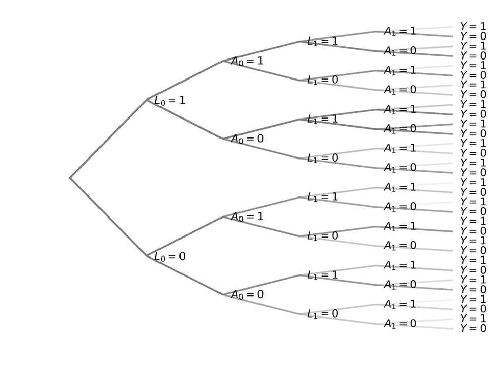
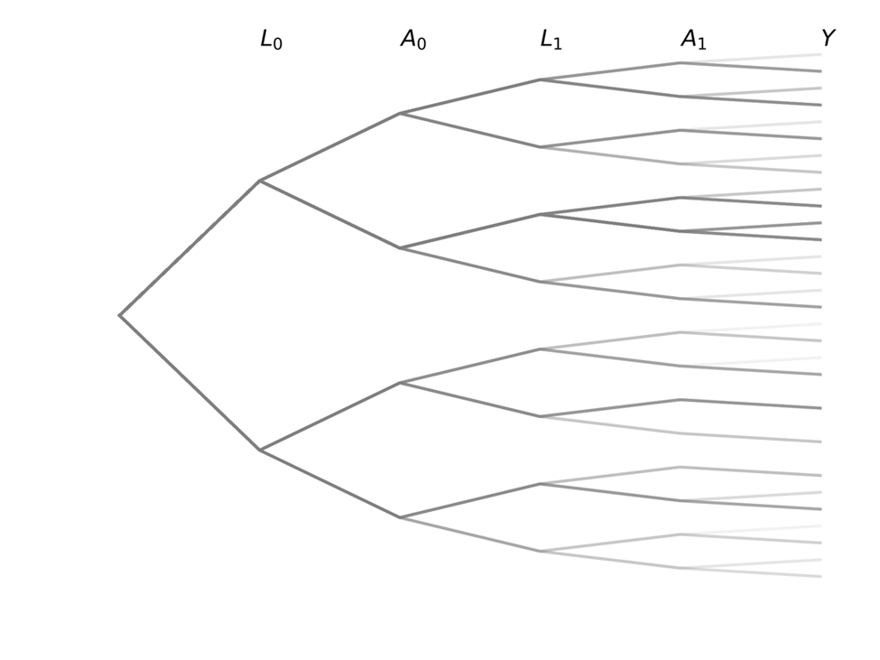
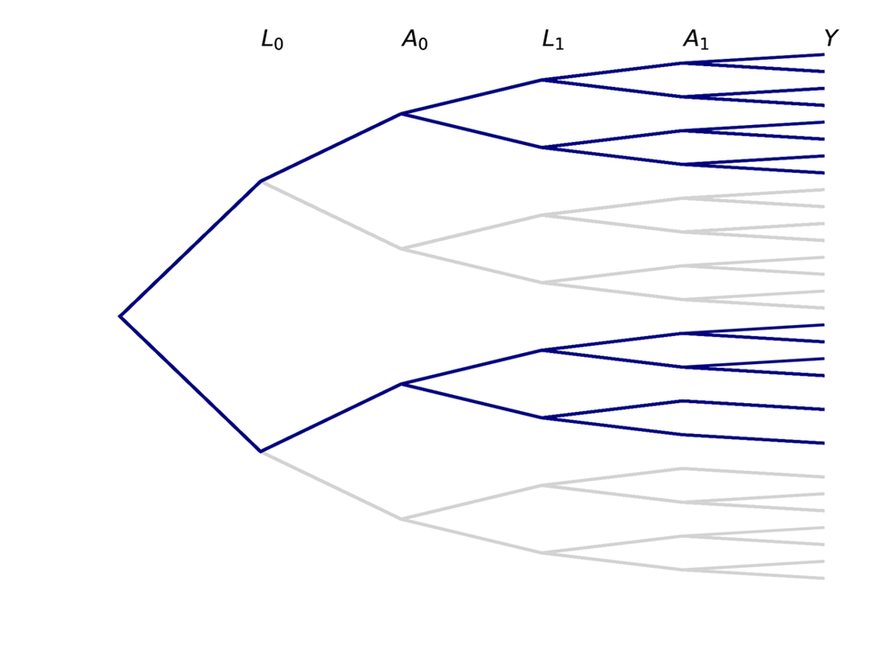
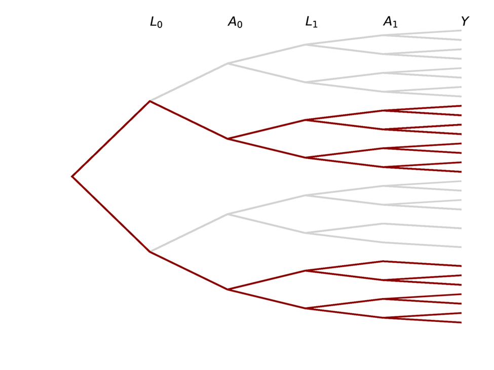
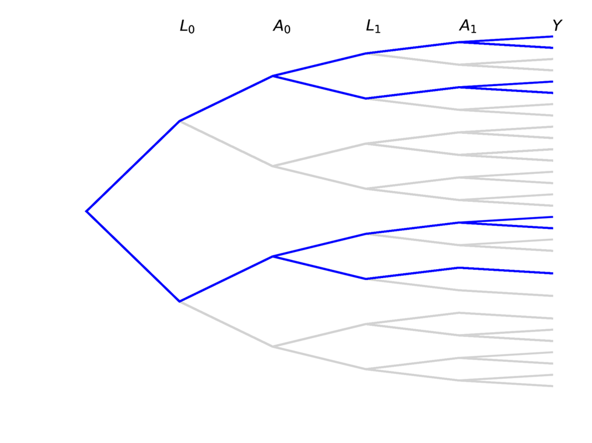
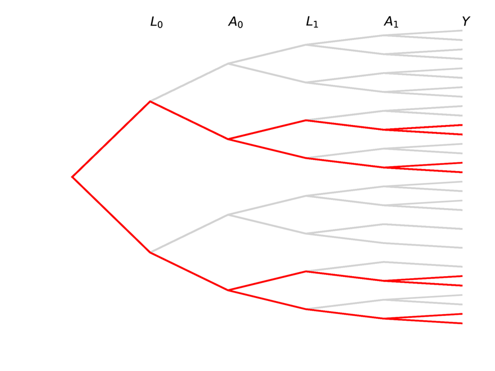

The following is a thread I created in 2020 as a basic introduction to structured tree graphs as a tool for defining
causal effects. Note that I have edited the language from the original thread in the following

## Structured Tree Graphs

Let $L$ be a binary confounder, $A$ be a binary treatment, and $Y$ be the binary outcome at end of follow-up. 
Here, subscripts indicate time. The data generating mechanism can be shown using the following tree graph

A person starts at the center node in the left and proceed down the branches of the tree until they hit the end bucket
($Y$). How people separate at each fork is following some probability.

This tree graph is a lot to look at with all the individual labels, so I am going to simply the graph only indicate the 
variables or columns. But remember that branch splits indicate the different values

The observed structure tree graph consists of individuals with all different trajectories. The black line indicates a 
single individual and their observed trajectory over time.

Causal inference contrasts different branch trajectories based on an intervention for $A$. For a point treatment 
(changing only $A_0$), we would be interested in comparing the proportions in each of the $Y$ buckets at the end for
the blue portion of the tree to the red portion

We can also be interested in time-varying exposures, where both $A_0$ and $A_1$ set to some value based on an 
intervention (simple example: both set to same value). The following trees represent this case

Note that there are some paths we have no interest in with time-varying exposures!

This data structure also has a direct connection to the parametric g-formula. The parametric g-formula uses the 
observed data to estimate the parameters of outcome models, then simulates individual trajectories for a large sample 
drawn with replacement. After simulating individuals, we can simply count up the number in each bucket.
